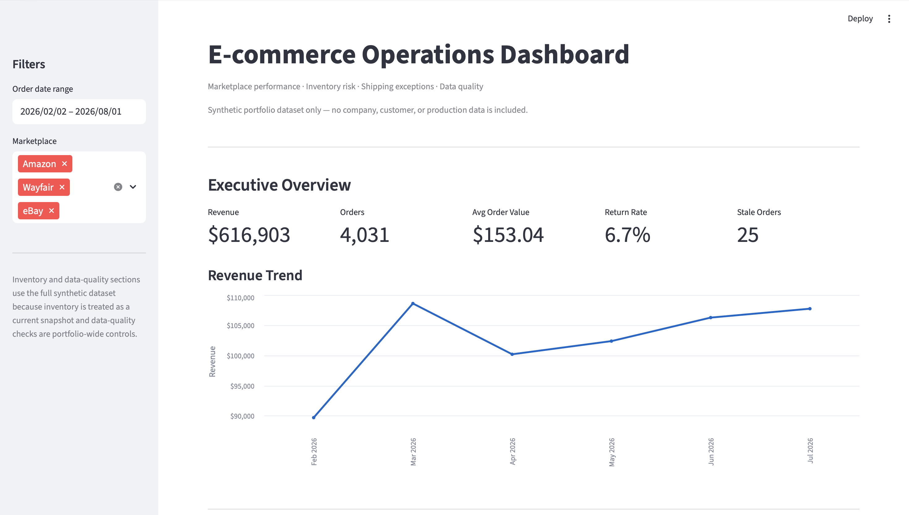

# E-commerce Operations Dashboard

An interactive e-commerce operations dashboard built with **Python, Pandas, Streamlit, and Altair**.

The project uses synthetic data to simulate common marketplace and operations problems involving sales, inventory, logistics cost, returns, exceptions, and data quality.

> No company, customer, or production data is included in this repository.

---

## Dashboard Preview



---

## Business Goal

The dashboard is designed around a common operations problem:

Data exists across orders, inventory, shipping, returns, and marketplace systems, but business teams need a single view that helps answer questions such as:

- How is revenue trending?
- Which marketplace is performing best?
- Which channel has unusually high return rates?
- Which SKUs are overstocked or at risk of stockout?
- Are logistics costs increasing?
- Which shipments require manual review?
- Are there data-quality issues that could affect reporting?

The goal is not only to visualize metrics, but to connect them to operational decisions.

---

## Key Findings

The synthetic dataset intentionally includes several operational scenarios:

- **$616K+ revenue** across approximately 4,000 active orders
- **Wayfair return rate around 11%**, materially higher than the other marketplaces
- **$102K+ of inventory value** tied up in overstocked SKUs
- One SKU with more than **27 weeks of supply**
- Recent **USPS average shipping cost increased by roughly 30%**
- Approximately **40 high-cost shipments** flagged for operational review
- **16 data-quality exceptions** across duplicate, missing marketplace, and missing shipping-cost checks
- A small set of deliberately stale orders requiring follow-up

These scenarios are synthetic but modeled after common e-commerce operations problems.

---

## Dashboard Areas

### Executive Overview

Tracks:

- Revenue
- Orders
- Average Order Value
- Return Rate
- Stale Orders
- Monthly Revenue Trend

The dashboard also supports filtering by date range and marketplace.

### Marketplace Performance

Compares:

- Revenue by marketplace
- Order volume
- Units sold
- Average Order Value
- Return Rate

The dashboard automatically identifies the marketplace with the highest return rate and surfaces it as an operational insight.

### Inventory Risk

Monitors:

- Available inventory
- Reorder points
- Average weekly sales
- Weeks of supply
- Inventory value
- Low-stock risk
- Overstock risk

The objective is to distinguish inventory that needs replenishment from inventory that may require a purchase hold, markdown, or clearance strategy.

### Logistics & Exceptions

Tracks:

- Average shipping cost by carrier over time
- Carrier cost trends
- High-cost shipment exceptions
- Package weight
- Service level

High-cost shipments are defined as approximately the top 1% of observed shipping costs and are flagged for review rather than automatically classified as errors.

### Data Quality

Includes checks for:

- Duplicate order IDs
- Missing marketplace values
- Missing shipping costs
- Invalid inventory quantities
- Returns without matching orders

The dashboard separates normal business reporting from records that require data-quality review.

---

## Why I Built This

Many analytics projects stop at charts.

I wanted this project to reflect the type of work I have done in e-commerce and operations environments, where the important question is usually not:

> What does the dashboard show?

but:

> What should the business investigate or do next?

This project focuses on connecting data analysis with operational decision-making, exception monitoring, and business-system workflows.

---

## Technology

- **Python**
- **Pandas**
- **NumPy**
- **Streamlit**
- **Altair**
- **SQL-style data transformation concepts**
- **Git / GitHub**

---

## Project Structure

```text
ecommerce-operations-dashboard/
├── README.md
├── requirements.txt
├── assets/
│   └── screenshots/
│       └── dashboard-overview.png
├── data/
│   ├── orders.csv
│   ├── inventory.csv
│   ├── shipping.csv
│   ├── returns.csv
│   └── processed/
│       ├── marketplace_summary.csv
│       ├── shipping_summary.csv
│       ├── shipping_outliers.csv
│       ├── return_summary.csv
│       ├── inventory_risk.csv
│       └── data_quality_summary.csv
└── src/
    ├── generate_data.py
    ├── transform_data.py
    └── app.py
```

---

## Data Pipeline

The project follows a simple analytics workflow:

```text
Synthetic Marketplace Data
          ↓
generate_data.py
          ↓
Raw CSV Files
          ↓
transform_data.py
          ↓
KPI / Risk / Exception Tables
          ↓
Streamlit Dashboard
          ↓
Business Review & Decisions
```

The generated dataset intentionally includes realistic exceptions so the dashboard has meaningful operational problems to investigate.

---

## Running Locally

Clone the repository:

```bash
git clone https://github.com/PossibleVince/ecommerce-operations-dashboard.git
cd ecommerce-operations-dashboard
```

Install dependencies:

```bash
python3 -m pip install -r requirements.txt
```

Run the dashboard:

```bash
python3 -m streamlit run src/app.py
```

Then open:

```text
http://localhost:8501
```

---

## Rebuilding the Dataset

The synthetic dataset can be regenerated with:

```bash
python3 src/generate_data.py
```

Then rebuild the processed analytics tables:

```bash
python3 src/transform_data.py
```

Because a fixed random seed is used, the generated dataset is reproducible.

---

## Live Demo

A hosted Streamlit demo will be added here.

---

## Notes

This repository is a portfolio project.

All orders, products, financial values, marketplaces, shipping records, inventory levels, and operational scenarios are synthetic or simplified examples.

No proprietary company logic or production data is included.